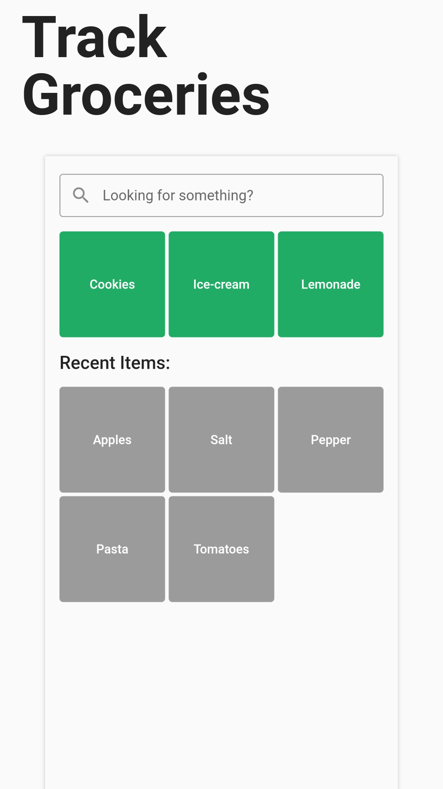

<p align="center">
  <a href="https://github.com/TomBursch/kitchenowl">
    
  </a>
</p>
<p align="center">
  <a href="https://github.com/TomBursch/kitchenowl">
    
  </a>
  <a href="LICENSE">
    
  </a>
  <a href="https://hub.docker.com/repository/docker/tombursch/kitchenowl">
    
  </a>
</p>

<div>
  <a href='https://play.google.com/store/apps/details?id=com.tombursch.kitchenowl'>
    
  </a>
  <!-- <a href='https://testflight.apple.com/join/x7LhltFw'>
    
  </a> -->
  <a href='https://testflight.apple.com/join/x7LhltFw'>
    
  </a>
</div>

<h1 align="center">
  KitchenOwl
</h1>

<h3 align="center">
  A grocery list and recipe manager
</h3>
<p align="center">
  KitchenOwl is a self-hosted grocery list and recipe manager. The backend is made with Flask and the frontend with Flutter. Easily add items to your shopping list before you go shopping. You can also create recipes and add items based on what you want to cook.
</p>

<h3 align="center">
 🍫 🥘 🍽
</h3>

## ✨ Features

The following features have been implemented:

- Add items to your shopping list and sync them with multiple users
- Partial offline support, so you don't lose track of what to buy even when there is no signal
- Manage recipes and add them to your shopping list
- Create a meal plan to know what you'll be eating
- Mobile/Web/Desktop apps

This project is still in development, so some features may not be fully implemented yet.

For a list of planned features, check out the [Roadmap](https://github.com/TomBursch/kitchenowl/wiki/Roadmap)!

## 📱 Screenshots





## 🤖 App Install

Get it on [Google Play](https://play.google.com/store/apps/details?id=com.tombursch.kitchenowl) or find the current release for your operating system on the [releases page](https://github.com/TomBursch/kitchenowl/releases).

## 🗄️ Server Install

You can either install only the backend or add the web-app to it. [Docker](https://docs.docker.com/engine/install/) is required.

### Backend only

Using docker cli:

```
docker volume create kitchenowl_data
```

```
docker run -d -p 5000:5000 --name=kitchenowl --restart=unless-stopped -v kitchenowl_data:/data tombursch/kitchenowl:latest
```

### Backend and Web-app

Recommended using [docker-compose](https://docs.docker.com/compose/):

1. Download the [docker-compose.yml](https://github.com/TomBursch/kitchenowl-backend/blob/main/docker-compose.yml)
2. Change default values such as `JWT_SECRET_KEY` and the URLs (corresponding to the ones your instance will be running on)
3. Run `docker-compose up -d`

## 🙌 Contributing

From opening a bug report to creating a pull request: every contribution is appreciated and welcomed. If you're planning to implement a new feature or change the API please create an issue first. This way, we can ensure your work is not in vain. For more information see [Contributing](CONTRIBUTING.md)

## 📚 Related

- [KitchenOwl Backend](https://github.com/TomBursch/kitchenowl-backend) Repository
- [DockerHub](https://hub.docker.com/repository/docker/tombursch/kitchenowl)
- Icon taken from [Those Icons](https://www.flaticon.com/authors/those-icons) and [Freepik](https://www.flaticon.com/authors/freepik)

### 🔨 Built With

- [Flask](https://flask.palletsprojects.com/en/1.1.x/)
- [Flutter](https://flutter.dev/)
- [Docker](https://docs.docker.com/)

## 📜 License

KitchenOwl is Free Software: You can use, study share and improve it at your will. Specifically you can redistribute and/or modify it under the terms of the Apache-2.0 License.
