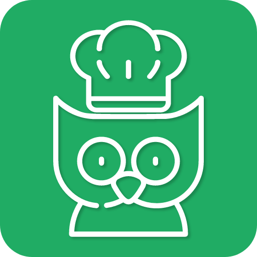
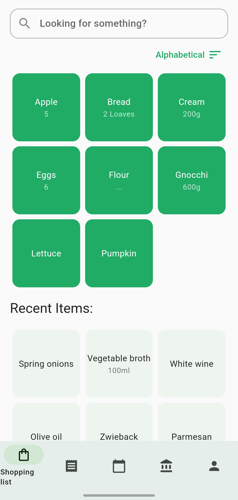
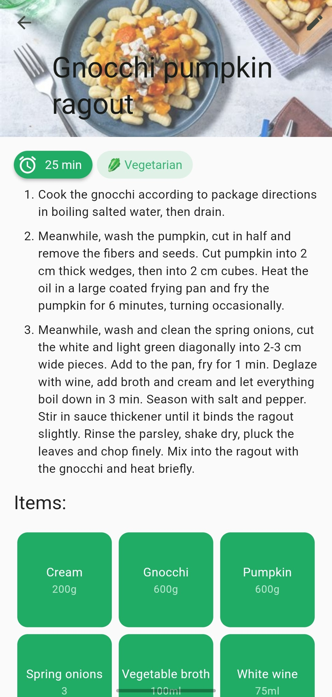
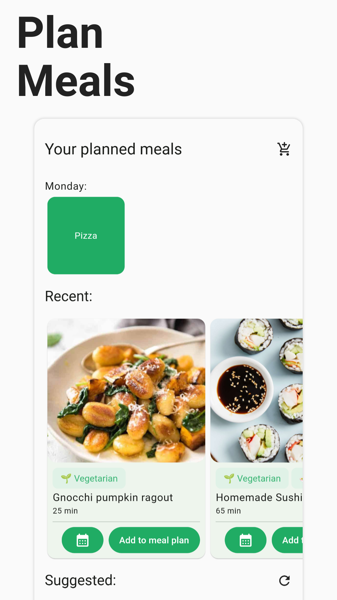
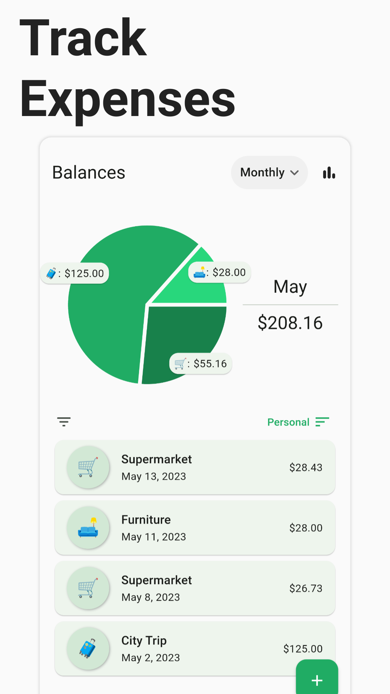

<h1 align="center">
  <picture>
    <source media="(prefers-color-scheme: dark)" srcset="./docs/docs/img/icon.png">
    
  </picture>
</h1>

  
A smart grocery list and recipe manager.

<h4 align="center">
  <a href="https://kitchenowl.org">Website</a> |
  <a href="https://docs.kitchenowl.org">Docs</a> |
  <a href="https://docs.kitchenowl.org/latest/self-hosting/">Self-Hosting</a> |
  <a href="https://matrix.to/#/#kitchenowl:matrix.org">Matrix</a>
</h4>

<h4 align="center">
  
  
  
  
  
  
</h4>

  
  
  

<h3 align="center">
 🍫 🥘 🍽
</h3>

KitchenOwl is a smart self-hosted grocery list and recipe manager. Easily add items to your shopping list before you go shopping. You can also create recipes and get suggestions on what you want to cook. Track your expenses so you know how much you've spent.

- Native Mobile/Web/Desktop apps with a great design
- Add items to your shopping list and sync them in real-time with multiple users
- Partial offline support, so you don't lose track of what to buy even when there is no signal
- Manage recipes and add them to your shopping list
- Share recipes with friends and family
- Create a meal plan to always know what you'll be eating
- Manage balances and track expenses of your household

Please keep in mind that this project is still in development.

For a full list check out the [website](https://kitchenowl.org). For a list of planned features, take a look at the [Roadmap](https://github.com/users/TomBursch/projects/1)!

## 📱 Screenshots

<table>
  <tr>
    <td></td>
    <td></td>
    <td></td>
    <td></td>
   </tr>
</table>

## 🤖 App Install

Get it in your favorite store or find the current release for your operating system on the [releases page](https://github.com/TomBursch/kitchenowl/releases).

## 🚀 Get started

Please take a look at the [get started guide](https://docs.kitchenowl.org/latest/self-hosting/).

## 🙌 Contributing

From opening a bug report to creating a pull request: every contribution is appreciated and welcomed. If you're planning to implement a new feature or change the API please create an issue first. This way, we can ensure your work is not in vain.
For more information see [Contributing](CONTRIBUTING.md) or get in contact by joining our [Matrix space](https://matrix.to/#/#kitchenowl:matrix.org).

### 🌍 Translations

You can help translate the App into your language by using [Weblate](https://hosted.weblate.org/engage/kitchenowl/)!

  

## 🛎️ Stay Up-to-Date

KitchenOwl is moving fast, to stay updated consider starring and watching the releases of this repository.

### 💬 Status

- [x] Public Alpha: Still working on stuff (rarely things might break)
- [ ] Public Beta: Stable and most planned features complete
- [ ] Public: Production-ready

## 📚 Related

- [Website](https://kitchenowl.org)
- [Docs](https://docs.kitchenowl.org)
- [KitchenOwl Backend](https://github.com/TomBursch/kitchenowl-backend) Repository
- [KitchenOwl Website](https://github.com/TomBursch/kitchenowl-website) Repository
- [DockerHub](https://hub.docker.com/r/tombursch/kitchenowl)
- Owl icon taken from [Freepik](https://www.flaticon.com/authors/freepik)
- [Recipe scrapers](https://github.com/hhursev/recipe-scrapers) used for scraping recipes from the web
- [Weblate](https://weblate.org/) is helping with continuous localization as part of their ongoing support for open-source software projects.

### 🔨 Built With

- [Flask](https://flask.palletsprojects.com/)
- [Flutter](https://flutter.dev/)
- [Docker](https://docs.docker.com/)

## 🍀 Contributors

## 📜 License

KitchenOwl is Free Software: You can use, study share and improve it at your will. Specifically you can redistribute and/or modify it under the terms of the AGPL-3.0 License.
