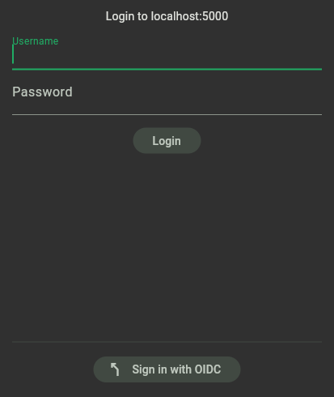

# OpenID Connect

OIDC allow users to sign in with social logins or third party issuer. KitchenOwl supports three providers: Google, Apple (only on iOS & macOS), and a custom one.

For self-hosted instances the custom provider is the most interesting one.

### Setup
Inside your OIDC you need to configure a new client, with the following to redirect URIs:

<div class="annotate" markdown>
- `FRONT_URL(1)/signin/redirect` 
- `kitchenowl:/signin/redirect`
</div>

1. FRONT_URL is the environment variable that exactly matches KitchenOwl's URL including the schema (e.g. `https://app.kitchenowl.org`)

KitchenOwl uses the token auth method `client_secret_post` and will request the following scopes: 

- `openid`
- `profile`
- `email`

You can then configure the backend using environment variables, just provide your issuer URL, client ID, and client secret:

```yaml
back:
    environment:
        - [...]
        - FRONT_URL=<URL> # front_url is requred when using oidc
        - OIDC_ISSUER=<URL> # e.g https://accounts.google.com
        - OIDC_CLIENT_ID=<ID>
        - OIDC_CLIENT_SECRET=<SECRET>
```

If everything is set up correctly you should see a *sign in with OIDC* button at the bottom of the login page.



### Linking accounts

When signing in using OIDC you're either logged into the linked account or, if none is present, a new account is created. The account creation will fail if an email already associated with a KitchenOwl account is provided by the identity management.

If you've already started using KitchenOwl or created an account first you can link an OIDC account to your existing KitchenOwl account. Just go to *settings* :material-arrow-right: Click on your profile at the top :material-arrow-right: *Linked Accounts* :material-arrow-right: and link your account.

Account links are permanent and can only be removed by deleting the KitchenOwl account. Users that signed in using OIDC are normal users that, after setting a password, can also sing in using their username + password. Deleting a user from your OIDC authority will not delete a user from KitchenOwl.


### Limitations
Currently only Web, Android, iOS, and macOS are supported.

### Apple & Google
These two providers will allow anyone to sing in with an Apple or Google account. They can be configured similarly to custom providers but will show up with a branded sign in with button.
It is not recommended setting up social logins for self-hosted versions as they might not work correctly.
```yaml
back:
    environment:
        - [...]
        - FRONT_URL=<URL> # front_url is requred when using oidc
        - APPLE_CLIENT_ID=<ID>
        - APPLE_CLIENT_SECRET=<SECRET>
        - GOOGLE_CLIENT_ID=<ID>
        - GOOGLE_CLIENT_SECRET=<SECRET>

```

### Example: Authelia

[Authelia](https://www.authelia.com/) is an open-source authentication and authorization server and portal fulfilling the identity and access management (IAM) role of information security in providing multi-factor authentication and single sign-on (SSO) for your applications via a web portal. It acts as a companion for common reverse proxies.

Place this in your Authelia [configuration.yaml](https://www.authelia.com/configuration/prologue/introduction/) to allow KitchenOwl to use Authelia as an OIDC provider.

```yml
- id: kitchenowl
    description: KitchenOwl
    secret: # Same as OIDC_CLIENT_SECRET
    public: false
    authorization_policy: two_factor # Can also be one_factor if you need less security
    pre_configured_consent_duration: 1M # One month - change this to something you desire
    audience: []
    scopes:
        - openid
        - email
        - profile
    redirect_uris:
        - https://your.domain.here/signin/redirect # Put the same value as FRONT_URL, appended with /signin/redirect
        - kitchenowl:/signin/redirect
    response_modes:
    userinfo_signing_algorithm: none
    token_endpoint_auth_method: client_secret_post
```
