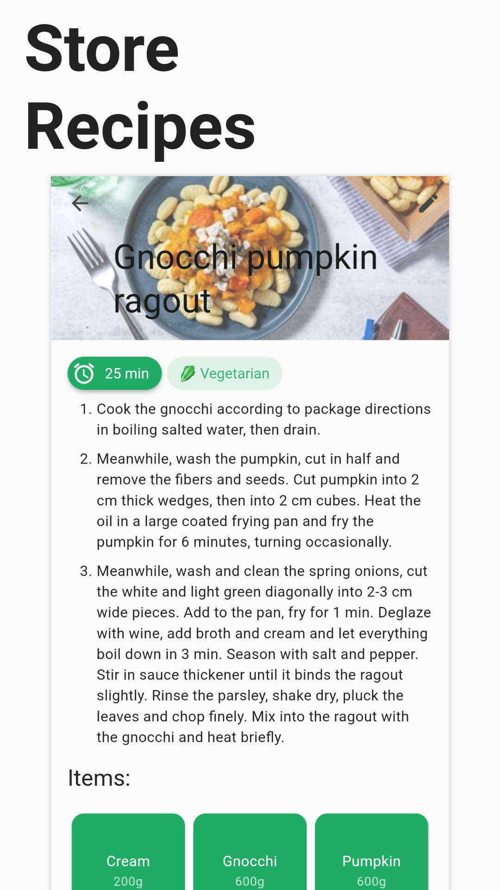
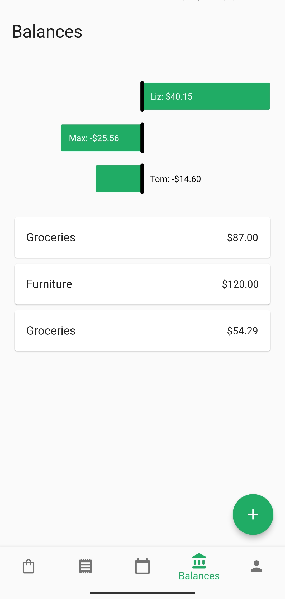
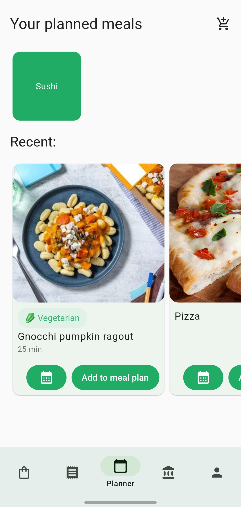
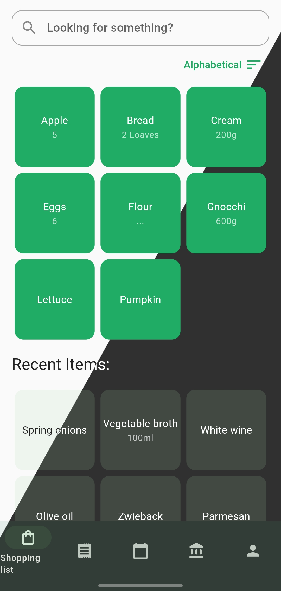
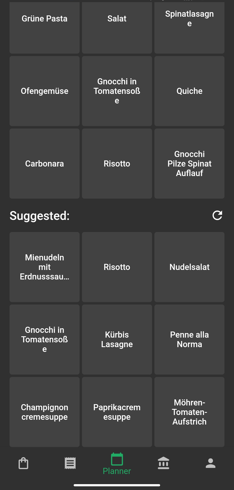

# Overview
<h3 align="center">
  A grocery list and recipe manager
</h3>

  KitchenOwl is a self-hosted grocery list and recipe manager. The backend is made with Flask and the frontend with Flutter. Easily add items to your shopping list before you go shopping. You can also create recipes and add items based on what you want to cook.

<h3 align="center">
 🍫 🥘 🍽
</h3>

## ✨ Features

The following features have been implemented:

- Add items to your shopping list and sync them with multiple users
- Partial offline support, so you don't lose track of what to buy even when there is no signal
- Manage recipes and add them to your shopping list
- Create a meal plan to know what you'll be eating
- Mobile/Web/Desktop apps

This project is still in development, so some features may not be fully implemented yet.

For a list of planned features, check out the [Roadmap](roadmap.md)!

## 📱 Screenshots

## 📜 License

KitchenOwl is Free Software: You can use, study share and improve it at your will. Specifically you can redistribute and/or modify it under the terms of the Apache-2.0 License.
[Read the License](about/license.md){ .md-button }